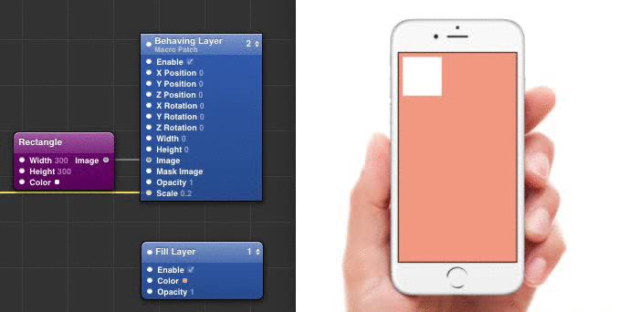

# qc-behavinglayer
===========

A quick fix to the X, Y positioning system that is currently implemented in Facebook's Origami Layer 2 patch.

My goal is to make it easier for designers to set the position of layer, when having the anchor point set to **center**. You will be able to set the X and Y coordinates as in relation to the top left corner of the view when the values are increasing as you go further from the point (just like in Photoshop, Sketch, iOS SDK, ...) and the values will be translated to the layer so it appears where you would like it to.

## TODO
- Do the calculations based on the anchor point setting
- Fix the demo gif